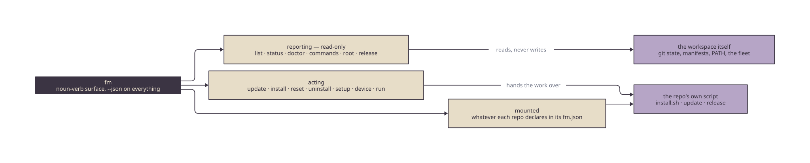

# fm-tools

First Motive's shared terminal tooling, as a pip-installable wheel.

## What

`fm-tools` carries the reusable, ROS-free half of First Motive's terminal UI:
the brand palette, the colour-coded step banners, the themed widget set, and a
generic `pick` menu. It was carved out of `fm-app`'s `fm_tui` package so any
First Motive repo can share one source of brand and one picker without pulling in
`rclpy` or the rest of the app.

The wheel depends only on `textual` and `rich` — no ROS, no `rclpy`. It imports
cleanly anywhere Python runs.

## Install

Distribution is git tag-pinned (PyPI-ready, not yet published):

```bash
uv pip install "fm-tools @ git+https://github.com/first-motive/fm-tools@v0.4.1"
```

## Usage

In Python:

```python
from fm_tools.tui import pick, emit

emit(1, "Detect OS")                       # branded step banner
backend = pick("Pick a backend", ["mujoco", "gazebo", "isaac"])
```

From a shell script (the `fm-pick` console entry prints the choice to stdout):

```bash
backend=$(fm-pick "Pick a backend" mujoco gazebo isaac)
```

## The `fm` CLI

`fm` is a thin CLI over every First Motive repo — one discoverable,
machine-readable surface for developers and AI agents landing cold. It ships as a
console entry point with the wheel.



Source: [`docs/diagrams/verbs.d2`](docs/diagrams/verbs.d2) — re-render with
[`docs/diagrams/render.sh`](docs/diagrams/render.sh).

Reporting verbs, all read-only and all taking `--json`:

| Verb        | Reports                                                        |
| ----------- | ------------------------------------------------------------- |
| `fm list`   | Every registered `fm-*` repo: name, git URL, entry points.    |
| `fm status` | Per-repo git state — branch, clean/dirty, ahead/behind. Repos not on disk are reported as `not cloned`, never faked. |
| `fm doctor` | Each repo's health checks — the declared ones (clone present, tools on `PATH`) plus derived ones (clone not behind origin, command manifest valid, installed `fm` matching its checkout, push guard enabled). Exits non-zero when any check fails, so it drops into CI. |
| `fm commands` | Every verb this `fm` answers to — built-in, forwarding, and whatever the repos on this machine mount. The list an agent should read instead of scraping `--help`. |
| `fm root` | The resolved workspace root and which source chose it. |
| `fm release` | Whether each repo's default-branch tip is green enough to tag: the commit a tag would land on, and the verdict of the check runs on it. Exits non-zero when any repo is not releasable. |

`fm --version` prints the running build, and names the fm-tools checkout's
version when the two differ. That gap is worth printing: `fm` is installed from a
pinned tag while its source keeps moving, and an installed build that has fallen
behind simply does not have the verbs the checkout declares. `fm doctor` fails on
the same drift.

Every `--json` payload is wrapped in a versioned envelope, so a reader can tell
which contract it is reading:

```json
{"schema_version": 1, "verb": "status", "data": [ ... ]}
```

`data` is the verb's rows. The version bumps when a field changes meaning or
disappears — never when one is added, since a reader that ignores unknown keys
keeps working.

Verbs that act, each by handing the work to a repo's own script:

| Verb                        | Does                                                |
| --------------------------- | --------------------------------------------------- |
| `fm update`                 | Fast-forwards every clean clone, then runs that repo's update script. A dirty tree is skipped, never clobbered. |
| `fm install <repo> [args…]` | Runs that repo's `install.sh`, forwarding every argument. |
| `fm reset <repo> [args…]` | Runs that repo's `install.sh reset` — teardown, in the repo's own words. |
| `fm uninstall <repo> [args…]` | Runs that repo's `install.sh uninstall`. |
| `fm setup [--role R] [--dry-run]` | Clones what is missing, adopts existing clones in place, runs each installer, then prints `fm doctor`'s verdict. |
| `fm device list\|ssh\|tunnel` | The fleet: which machines exist, connecting to one, forwarding a port off one. |
| `fm diagram list\|render\|check\|watch` | Every diagram in the workspace, and the per-repo renderer behind each one. |
| `fm run -- <command>` | Runs a raw command and records it as a missing verb. |
| `fm release --repo R --cut -- [args…]` | Runs that repo's release script, but only once CI is green on the commit a tag would land on. |

Tags are where this matters most. Rigs converge on release tags, never on
`main`, so a tag is the moment work reaches the fleet — and with no server-side
branch protection on the private repos, it is the moment with no gate on it. The
gate resolves the *remote's* default-branch tip rather than local `HEAD` (a
maintainer's checkout holds whatever they were last working on), reads the check
runs on that commit, and releases only on `green`. `pending` and `unknown` are
refusals: a commit nothing has checked is what the gate exists to catch.

```bash
fm list                       # rich table
fm status --json              # machine-readable, parseable by an agent
fm doctor                     # exits non-zero if a check fails
fm setup --dry-run            # read the plan before anything is written
fm release                    # is the fleet's next tag safe to cut?
fm release --repo fm-ros2 --cut -- --minor --apply
fm setup --role workstation   # stand up a GPU workstation
fm setup --role jetson        # stand up a Jetson capture rig
```

`--role` never changes which repos are set up. It decides what each repo's
installer is told: on a Jetson, `fm-setup` is given `--jetson` and `fm-ros2` is
given `--recorder --service`. Those flags are declared per repo in the registry,
because a flag one installer understands is an error to another.

A repo that names a platform is skipped elsewhere rather than cloned and failed
against — `fm-desktop` is a native macOS app, so a Linux setup run skips it, and
`fm-setup` provisions machines, so a macOS run skips that.

### Repo Commands

Repos mount their own verbs. A repo declares them in a top-level `fm.json`:

```json
{
  "version": 1,
  "commands": {
    "teleop": {"script": "scripts/run/teleop.sh", "help": "jog a robot arm"}
  }
}
```

Each entry becomes a flat verb, run from inside that repo's checkout with every
argument forwarded untouched:

```bash
fm teleop --robot openarm --backend mock    # runs fm_ros2's teleop.sh
```

The CLI parses none of those flags, so the script stays the single source of
truth for its own interface. Two repos claiming one verb is reported by
`fm doctor`, and the first in registry order keeps it; a manifest can never
shadow a built-in verb. `fm --help` lists whatever the repos on this machine
declare, and `fm commands --json` says the same thing to an agent.

#### Nouns, not just verbs

Because arguments are forwarded untouched, a repo can mount a **noun** and let
its script dispatch the verb:

```bash
fm machine init --name fm-rec-01   # runs fm-setup's scripts/run/machine.sh init
fm machine show --json
```

`fm.json` declares `machine` once; `init`, `show`, `doctor`, and `reset` live in
the script, where the work does. The dispatcher needs no knowledge of this and
must never gain any — noun-verb is a property of forwarding arguments verbatim,
and special-casing it in the CLI would put half of a repo's interface back in
this wheel. Prefer a noun whenever a repo has more than one or two related
workflows: one mounted name, no release of `fm-tools` to add a verb behind it.

### Workspace Root

Every verb resolves repos under one workspace root, chosen in this order:

1. `FM_HOME`, if set
2. the machine identity card's `workspace` — `/etc/fm/machine.json` on Linux,
   `~/.config/fm/machine.json` on macOS, `$FM_MACHINE_FILE` to override
3. `~/.config/fm/config.json`, holding `{"root": "/path/to/workspace"}`
4. `~`

The card outranks the config file because it is the host's own statement of what
it is: on a provisioned machine the workspace is a property of the machine, and a
stale per-user config that disagrees is the drift the card exists to delete.
`FM_HOME` still beats both, because an override nobody can override is not one.

Nothing in the chain reads the working directory, so `fm status` reports the same
repos from anywhere on the machine. A card written to a schema this build does
not know is **refused, not guessed at**, and a malformed config file is fatal
rather than skipped — falling through to the next source is how a typo becomes a
silently different workspace. A machine with no card at all is normal: a laptop
in client mode has no workspace to declare.

`fm root` says which root was chosen and which source said so:

```bash
fm root --json      # {"root": "/home/fm/fm", "source": "card", ...}
```

`fm` never moves a checkout — an existing layout is adopted exactly where it is.

### The Diagrams

Each repo renders its own diagrams and CI fails on a committed SVG that drifted
from its source. What no repo could answer is what the workspace holds *in
total*, which is the question anyone building a picture of the system asks first.

```bash
fm diagram list --json                # every .d2 in the workspace, and its render
fm diagram render --repo fm-data      # re-render, through that repo's render.sh
fm diagram check                      # the drift gate CI runs, across every repo
fm diagram watch                      # re-render on save while you edit (fswatch)
```

A repo joins this view by carrying the rendered `docs/diagrams/render.sh`, so
nothing here names repos. `render` and `check` delegate to that script rather
than re-implementing it: the command a developer runs and the command CI runs
have to be the same one, or a green check proves nothing. `list --json` is the
manifest First Motive Desktop's diagram surface reads, so a diagram added in any
repo appears in the app with no change to the app.

### The Fleet

`fm device` treats the machines as a registry instead of as strings people
remember. There is nothing new to maintain: the registry is the tailnet
(`tailscale status --json` — which machines exist, and how to reach each one
right now) plus each machine's identity card (what a machine *is*).

```bash
fm device list --json                 # every fleet machine, its role, its ssh target
fm device ssh fm-rec-01               # connects as the account the role implies
fm device ssh fm-rec-01 -t journalctl -u fm   # everything after the name is ssh's
fm device tunnel fm-rec-01 9090:8080  # forward localhost:9090 to its 8080
```

No hostname, address, or account is written down in this repo. A machine's role
comes from the `fm-<abbrev>-<nn>` shape the card's schema pins (`fm-rec-01` is a
jetson), and the user follows the role: the provisioned machines run as the
appliance account, while a `mac` is somebody's laptop, so its target carries no
user at all and `~/.ssh/config` decides. Machines the tailnet knows that are not
named the fleet way — phones, personal laptops — are left out rather than listed
as unknowns nobody can act on.

### Credentials

A token is never typed. `fm` refuses a literal secret anywhere on its command
line, for every verb, before anything runs:

```console
$ fm flash --gh-token ghp_…
fm: refusing --gh-token on the command line — a secret typed as an argument is in
your shell history and in this machine's process list, and neither copy can be
revoked. Remove it: fm reads the token from `gh auth token` or the login Keychain.
```

A repo command that genuinely needs one declares it, and the broker supplies it
through the child's environment from `gh auth token` or the login Keychain:

```json
{"flash": {"script": "scripts/run/flash.sh", "credentials": ["github"]}}
```

Only a command that declared a credential causes one to be fetched — a verb that
needs no secret never triggers a Keychain prompt, and a token that was never
fetched cannot leak. Nothing in `fm` prints a token, writes one to a file, or
puts one in a report.

### Bypasses

`fm run -- <command>` runs a raw command exactly as typed and appends one record
to `~/.local/state/fm/bypass.jsonl` (`$XDG_STATE_HOME` honoured):

```json
{"schema_version": 1, "when": "…", "command": ["ssh", "…"], "cwd": "…", "exit": 0}
```

Every raw command someone runs instead of a verb is a verb that does not exist
yet, and the log is that backlog. Output is never captured, and a command line
carrying a literal secret is refused before it runs — so nothing sensitive can
reach the record.

### Exit Codes

One contract, every verb:

| Code | Meaning |
| ---- | ------- |
| 0 | Success. |
| 1 | Reported unhealthy state — `fm doctor` had a failing check. The command ran correctly; the answer is bad. |
| 2 | Usage error — unknown verb, unknown repo, unknown flag, missing argument. Matches argparse's own code. |
| 3 | Precondition failure — unresolvable workspace root, repo not cloned, declared script missing or not executable, a required credential unavailable, a machine card this build refuses to read. |
| 4 | Delegate failure — a repo's own script ran and failed while `fm` was aggregating several of them (`fm update`, `fm setup`). |
| 130 | Interrupted (SIGINT). |

The passthrough verbs are the deliberate exception: `fm <repo verb>`,
`fm install`, `fm reset`, `fm uninstall`, `fm device ssh`, and `fm run` each run
exactly one process and return **its** exit code untouched, because going through
`fm` must be indistinguishable from running the script directly. A process killed
by a signal reports `128 + n`, the way a shell reports it. Codes 3 and 4 cover
what `fm` itself detects on either side of that run.

`fm status` fetches each clone by default, so its ahead/behind counts mean
something. `fm status --no-fetch` answers from the refs already on disk — for a
plane, a sealed CI runner, or an agent polling in a loop.

### Install the CLI

`uv pip install` above imports the wheel; it does not put `fm` on your `PATH`. To
install the CLI system-wide for a developer, run the installer from a clone:

```bash
git clone https://github.com/first-motive/fm-tools
cd fm-tools && ./install.sh          # uv tool install; fm + fm-pick onto PATH
```

`./install.sh` installs a pinned release tag as an isolated `uv` tool. Other
subcommands:

```bash
./install.sh status                  # is fm installed and on PATH?
./install.sh install --dry-run       # print the resolved install spec, install nothing
./install.sh uninstall               # remove the fm CLI
```

If `fm` is not found after install, run `uv tool update-shell` once, then restart
your shell. Override the release with `FM_TOOLS_REF` (git tag) or `FM_TOOLS_REPO`
(owner/repo); the default tag tracks this wheel's version.

### Boundary: delegate, never duplicate

The CLI owns discovery, routing, and reporting — nothing else. Each repo keeps
its own bootstrap front door (`install.sh` / `run.sh`) and its own workflow
scripts; `fm` finds them, runs them, and reports what happened. It shells out to
`git` for state, and it never reimplements what a repo already does. The repo
registry is an in-package Python module (not TOML) so it stays zero-dependency
and packages with the wheel; the verbs a repo exposes live in that repo's
`fm.json`, so adding one needs no release of this wheel.

Still deferred: GitHub org auto-discovery, a `--stable` release channel, and an
interactive `pick` menu over the verbs.

## Development

```bash
uv run pytest
```

See `CONTRIBUTING.md` for the branch, commit, and PR workflow.

## License

Apache-2.0 — see `LICENSE`.
