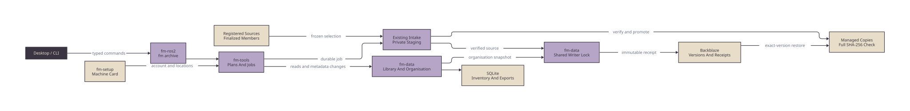

# Cloud Storage Coordinator



Source: [cloud-storage.d2](diagrams/cloud-storage.d2).

`fm archive` remains registered by fm-ros2. Its `library`, `copy`, and `jobs`
groups call this package through the Data archive wrapper. The wrapper uses
the existing service credential route. Flat archive verbs and `data-archive`
retain their existing meanings. `service status|preflight|reconcile|install`
names the service operations explicitly.

A client-only Tools installation exposes `fm archive --host` through SSH
when no workspace manifest owns `archive`. It does not reserve that verb or
replace the workspace owner. Local download needs no Data checkout or
provider credentials on the Mac.

## Configure The Coordinator

Install fm-tools with the `archive` extra and a matching fm-data checkout.
The selected nested Data checkout takes precedence over a sibling checkout;
an old selected package is refused. The machine card's version-1 `storage`
object supplies the coordinator account, private state directory, and named
locations. Use fm-setup's machine schema and `machine init --storage-config`.
Hostnames and paths belong on that card, not in client requests.

SSH authenticates callers as the configured account. All holders of that
account's SSH access are trusted operators with the same authority. The
recorded actor is that account; it does not identify an individual person.
There is no public HTTP endpoint or new permission authority. Desktop sends
IDs and closed command arguments. It holds no provider credentials.

The coordinator state directory must be owned by its effective UID with no
group or other access. Managed destinations must have safe parent directories.
Copy staging is private, and symlinks, traversal and conflicting destinations
are refused. Source discovery reads only configured roots. A source host needs
Python 3 for the bounded metadata probe and rsync for intake.

## Commands

Every new command accepts `--json`. Responses carry `contract_version: 1`,
`operation`, `request_id`, `ok`, and either `data` or `error_code`. A refusal
does not return success with empty data.

```sh
fm archive --host <coordinator> library locations --json
fm archive --host <coordinator> library refresh --location <location> --json
fm archive --host <coordinator> library list --limit 100 --offset 0 --json
fm archive --host <coordinator> library search 'can pick' --json
fm archive --host <coordinator> library show <item> --json
fm archive --host <coordinator> library files <item> --location <location> --json
fm archive --host <coordinator> library preview <item> --location <location> --member <member> --json
fm archive --host <coordinator> library history <item> --json
fm archive --host <coordinator> library select --revision <revision> --format <format> --json
```

Use the returned revision on subsequent pages. If it changes, reload page
zero. Browsing does not hash media or scan the bucket. An explicit location
refresh can scan the provider. A failed scan retains last-known copies. A
cached catalogue keeps its original observation time and partial coverage.
Unknown formats and offline locations remain visible.

A Backblaze catalogue item keeps its catalogue id as its source identity but
is named for a person: a take by its task and operator (`Move empty bottle ·
wynand`) with its recorded day and task, a processing set by the take it came
from, and a glove CSV with no take by its glove. fm-data groups a take's glove
CSVs into the take, and the take's file list includes them. Lists are newest
first. An item every location confirms is gone leaves the default list and
stays reachable with `--copy-state absent`.

Preview reads one selected member: text is limited to 64 KiB and images or
videos to 8 MiB. Larger media and cloud-only members require a verified
download. History records organisation changes; jobs and copy facts provide
the separate transfer evidence. Desktop saves its last library page and marks
it as a saved snapshot when the coordinator is unavailable.

`library select` freezes up to 10,000 matching IDs at one library revision.
Pass its ID with `--selection` to a copy plan, item filing, or collection
mutation. A changed revision is refused. Execution never reruns the filter.

The item identity includes producer and source identity. A validated managed
source receipt can join a source and its archive copy. An unproven legacy
catalogue identity stays separate. Verification and receipt facts do not follow
from file size or presence alone.

```sh
fm archive library folder create --name 'Can picking' --revision <revision> --request-id <request> --json
fm archive library folder rename <folder> --name 'Can picking pilot' --revision <revision> --request-id <request> --json
fm archive library folder move <folder> --parent <parent> --revision <revision> --request-id <request> --json
fm archive library item file --item <item> --folder <folder> --revision <revision> --request-id <request> --json
fm archive library collection create --name 'Review set' --revision <revision> --request-id <request> --json
fm archive library collection add <collection> --item <item> --revision <revision> --request-id <request> --json
fm archive library item tags <item> --tag pilot --revision <revision> --request-id <request> --json
```

Folder, name, tag and collection changes are metadata operations. They upload
no recording bytes. Optimistic revisions prevent lost updates; a repeated
request ID must carry the same command and expected revision. Folder removal
requires explicit reassignment when it would orphan items. Folder cycles and
normalised duplicate names are refused.

## Plan And Run A Copy

```sh
fm archive copy plan --source <location> --destination <location> --item <item> --revision <revision> --json
fm archive copy show <plan> --json
fm archive copy start <plan> --request-id <request> --json
fm archive jobs list --json
fm archive jobs show <request> --json
fm archive jobs wait <request> --timeout 30 --json
fm archive jobs pause <request> --json
fm archive jobs resume <request> --json
fm archive jobs cancel <request> --json
fm archive jobs retry <request> --json
fm archive copy verify <item> --location <location> --full --json
```

A plan freezes exact source members, hashes, item revisions, named endpoints
and the configuration digest. It expires after 24 hours. Execution rechecks
the source; it never adds a later match. Jobs use the existing detached Tools
worker and its single-writer queue. Closing Desktop does not stop a job.
Pause and cancel act at safe transfer boundaries and retain completed work.
Multipart uploads retain their provider upload IDs. Resume reuses the same
request and frozen plan; it cannot silently change the selection.

Plans report the route, expected new bytes, temporary bytes and destination
reuse or staging result. Remote destination conflicts and free space are
checked before a job starts. Transient rsync failures get at most three
attempts; permission and format failures need an operator correction.

Supported source adapters are:

| Adapter | Inventory | Copy Boundary |
| --- | --- | --- |
| `recordings` | Recorder session index | One finalized FM Data MCAP take, its sidecar and exact episode tactile files; require two minutes of source quiet and closed MCAP shards. |
| `anvil` | Sessions and episode status metadata | A complete finalized session through the existing governed intake route; refuse an active or unknown session on the source. |
| `lerobot` | Versioned dataset metadata | A complete v3.0 dataset, including shared files. Require a full match to its governed conversion or derivative receipt, or a wholly read-only tree. v2 and unknown formats remain readable inventory, not copy candidates. |
| `catalogue` | All existing archive catalogue kinds | Managed source and native raw/derived receipts support exact-version restore. Unreceipted legacy objects remain browsable and need receipt reconciliation before verified restore. |
| `imports` | Accepted copy bindings | Receive into a registered private import root; verify exact members and bytes before publishing a copy. Accepted copies can be copied again. |
| `evidence` | One explicitly configured published evidence directory | Require the directory and every member to be read-only. Copy the complete set as `evidence-v1`; preserve source, review and consumer digests inside the original evidence files. |
| `unsupported` | Explicit coverage state | No source adapter is inferred. Accepted copies at that destination retain their evidence. |

The local byte-copy and archive paths verify complete membership and SHA-256
before acceptance. Existing destinations must match exactly. The uploader
rechecks an accepted receipt on replay, including after loss of its local
receipt cache. Restore uses the recorded provider versions and never replaces
them with a newer object at the same key. No source deletion is implemented.

For the robot processing archive case, register the published raw session,
governed dataset, and published review/consumer evidence with their owning
adapters. Select and copy each set, then retain the item revisions and receipt
digests in the acceptance report. A dataset copy alone does not archive its
sibling conversion receipt or review state. Include those original records in
the evidence export. Storage does not create or change a human approval.

## Copy To Another Host Or This Mac

A remote destination uses `adapter: imports`, `ssh_host`, and
`remote_location` on the coordinator card. That remote ID must name a local
`imports` location on the receiver card with `root` and `copy_destination`.
Add `copy_source` to permit a later copy from it. Both hosts need matching
Tools and Data versions. The receiver owns the root path and accepted-copy
evidence. Register only an approved import directory, never a capture root.

To download to a Mac, plan a copy to `operator-download`, start it, and wait
for its job to complete. The coordinator verifies a staging copy first.

```sh
fm archive copy download <plan> --coordinator <ssh-alias> --destination <local-directory> --json
```

Desktop offers **Save download** for a completed download job. The client
pulls only the frozen members over SSH, checks every SHA-256, and writes a
local receipt. Repeating this command resumes private staging or reuses an
exact existing copy. Conflicting content is refused. Verified staged files
reduce the remaining space estimate. The coordinator job persists if Desktop
closes; rerun the local download command if its client process stops.

## Share The Archive Writer

Before enabling coordinator uploads, install the matching Data uploader and
set `FM_ARCHIVE_WRITER_LOCK` to the same private lock file in the uploader
service environment and coordinator environment. Provision that file for the
coordinator account before starting the root-owned service. Both writers use
the same per-object lock. A coordinator upload without this setting refuses.
The existing uploader bandwidth and retention environment settings apply;
the default upload ceiling is 8 MiB/s. Writer key scope and live bucket policy
checks must pass before new cloud writes.

A recording source defaults to `archive_writer: legacy`. It cannot start a
second cloud writer through the library. Set `archive_writer: coordinator`
only after the old uploader stops watching that exact source scope. Retain the
old recordings, receipts and timer configuration in the migration record.

New source placement and immutable receipts are defined by fm-data's
`fm_data_archive/ARCHIVE_LAYOUT.md`. Models, showcase objects and legacy
unclassified content gain no new writer scope from being visible.

## Protect And Recover Organisation

```sh
fm archive library protect --json
fm archive library recover <snapshot-source-revision> --json
```

Each organisation transaction also saves an export. `protect` uploads the
latest complete export as receipt-bound `evidence-v1` source metadata. It
reports the exact protected revision. Later edits can still be local-only.
This operation uses the same writer checks and does not upload recordings.

Recovery requires an empty library and an exact archived snapshot revision.
It restores organisation, source inventory and managed-copy manifest bindings.
Recovered copy evidence is stale until locations are refreshed. It does not
claim that an offline source is absent. Do not recover over a live library.

## Install And Rehearse

Ship matched fm-data, fm-tools, fm-ros2, fm-setup, Robot Agent and Desktop
revisions. Provision the approved coordinator account and both managed roots
before enabling copies. Reconcile legacy receipts and uploader scopes before
granting coordinator ownership. No install, provider write, legacy adoption,
timer change or data migration occurs merely by checking out these branches.

Keep a dated acceptance report with revisions, item and job IDs, source and
destination inventories, receipt digests, SHA-256 comparisons and replay
commands. Exercise source-busy refusal, pause/resume, replay, destination
conflict, offline inventory and snapshot recovery. Use permitted idle windows;
the storage workflow must not start capture or robot motion.

Rollback disables new writer capabilities and restores the earlier client and
service routes. Preserve coordinator state, receipts, source bytes and object
versions. Do not delete data to roll back. Automatic upload policy, local
cleanup, provider deletion and retention administration remain separate work.
